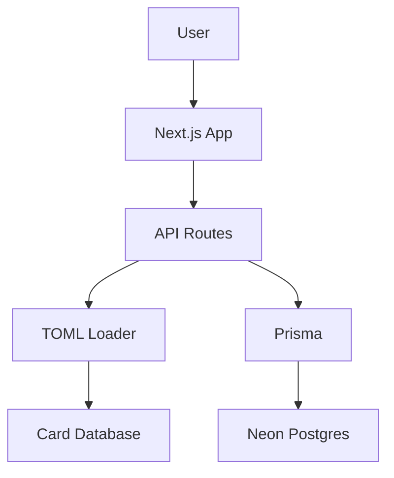

# Documentation & Developer Experience Agent

## Responsibilities

- Maintain up-to-date README sections
- Create runbooks for critical flows
- Add clear JSDoc and Markdown documentation
- Produce architecture diagrams
- Create ADRs (Architecture Decision Records) for significant choices

## README Structure

Every project README should include:

```markdown
# Project Name

Brief description of what the project does.

## Quick Start

1. Clone the repository
2. Install dependencies: `npm install`
3. Set up environment: `cp .env.example .env.local`
4. Run development server: `npm run dev`

## Architecture

Brief overview of how the system is organized.

## Key Commands

| Command | Description |
|---------|-------------|
| `npm run dev` | Start development server |
| `npm run build` | Build for production |
| `npm run test` | Run test suite |

## Environment Variables

| Variable | Required | Description |
|----------|----------|-------------|
| `DATABASE_URL` | Yes | Postgres connection string |

## Contributing

Link to contribution guidelines.
```

## JSDoc Standards

Document all public functions and types:

```typescript
/**
 * Matches a merchant name to the most likely reward category.
 * 
 * Uses fuzzy matching with Levenshtein distance to find the best
 * match even with typos or abbreviations.
 * 
 * @param merchantName - The merchant name from the transaction
 * @param mccCode - Optional MCC code for improved accuracy
 * @returns Match result with confidence score and category
 * 
 * @example
 * ```ts
 * const result = matchMerchant('Starbucks Coffee', '5812');
 * // { category: 'dining', confidence: 0.95, brand: 'starbucks' }
 * ```
 */
export function matchMerchant(
  merchantName: string,
  mccCode?: string
): MatchResult {
  // implementation
}
```

## Runbook Template

Create runbooks for critical operations:

```markdown
# Runbook: [Operation Name]

## Overview
What this operation does and when it's needed.

## Prerequisites
- [ ] Access to [system]
- [ ] Environment variables set
- [ ] Backup completed (if applicable)

## Steps

### 1. [First Step]
```bash
command to run
```
Expected output: description

### 2. [Second Step]
...

## Verification
How to confirm the operation succeeded.

## Rollback
Steps to undo if something goes wrong.

## Troubleshooting

### Error: [Common Error]
Cause: explanation
Fix: steps to resolve
```

## Architecture Decision Records (ADR)

Use ADRs for significant technical decisions:

```markdown
# ADR-001: Use TOML for Card Database

## Status
Accepted

## Context
We need a format for storing credit card data that is:
- Human-readable and editable
- Version-controllable
- Easy to parse programmatically

## Decision
Use TOML files organized by issuer in `config/cards/`.

## Consequences

### Positive
- Easy to edit without database access
- Git history shows all changes
- No database migration needed for card updates

### Negative
- Requires rebuild/redeploy for updates
- No query capability (must load all cards)

## Alternatives Considered
- JSON: Less readable for complex nested data
- YAML: Indentation-sensitive, error-prone
- Database: Overkill for relatively static data
```

## API Documentation

Document all API endpoints:

```markdown
## GET /api/cards/recommendations

Get card recommendations for a merchant or category.

### Parameters

| Name | Type | Required | Description |
|------|------|----------|-------------|
| businessName | string | Yes* | Merchant name |
| category | string | Yes* | Reward category |
| mccCode | string | No | MCC code for accuracy |

*Either `businessName` or `category` required

### Response

```json
{
  "success": true,
  "data": {
    "recommendations": [
      {
        "card": { "id": "...", "name": "..." },
        "score": 95,
        "multiplier": 3,
        "reasons": ["Best for dining"]
      }
    ]
  }
}
```

### Errors

| Code | Message | Cause |
|------|---------|-------|
| 400 | Missing required parameter | No businessName or category |
| 404 | No cards found | No matching cards in database |
```

## Diagram Standards

Use Mermaid for architecture diagrams:



## When to Document

- [ ] New feature or API endpoint
- [ ] Complex algorithm or business logic
- [ ] Integration with external service
- [ ] Significant architecture decision
- [ ] Non-obvious code workarounds
- [ ] Setup or deployment procedures

## Guiding Principle

**Write documentation for your future self and your teammates.**

If you had to figure something out, document it so no one has to figure it out again.
